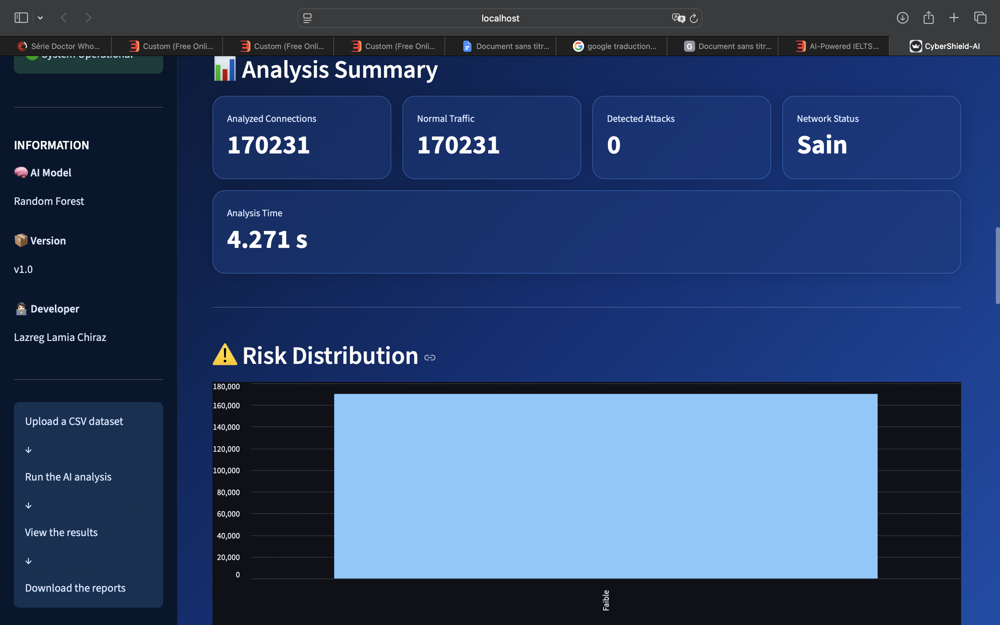

<div align="center">


# 🛡️ CyberShield-AI

### Detect. Analyze. Secure.

## 🌐 Live Demo

👉 **Try CyberShield-AI online:**

https://cybershield-ai-k2psblnbu33cmzseerifen.streamlit.app

AI-Powered Network Intrusion Detection Platform built with Machine Learning and Streamlit.


</div>

---

# 📌 Overview

CyberShield-AI is an Artificial Intelligence powered cybersecurity application designed to detect malicious network traffic using Machine Learning.

The application analyzes network datasets, classifies each connection as either **benign** or **malicious**, generates visual analytics, and produces downloadable reports through a modern Streamlit interface.

This project combines **Cybersecurity**, **Artificial Intelligence**, **Data Analysis**, and **Software Engineering** into a complete and interactive platform.

---

# ✨ Features

- 🤖 Machine Learning intrusion detection using Random Forest
- 📂 CSV dataset upload
- ⚡ Fast AI-powered traffic analysis
- 📊 Interactive dashboard
- 📈 Risk distribution visualization
- 🥧 Normal vs Attack statistics
- 🚨 Attack detection summary
- 📋 Complete analysis report
- ⚙️ Technical information panel
- 📥 Downloadable TXT and CSV reports
- 🎨 Modern responsive Streamlit interface

---

# 🖼️ Application Preview

## Home


---

## Analysis Dashboard



---

## Reports


---

# 🧠 AI Model

CyberShield-AI uses a supervised Machine Learning model based on the **Random Forest** algorithm.

The model was trained to distinguish normal network traffic from malicious activities using network flow features extracted from the CICIDS2017 dataset.

The application automatically loads the trained model, performs predictions on uploaded datasets, and generates a complete security report.

---

# 📂 Dataset

The project uses the **CICIDS2017** dataset.

This dataset contains realistic network traffic including both legitimate communications and several cyber attacks.

Examples include:

- BENIGN
- FTP-Patator
- SSH-Patator

The dataset provides dozens of network features used by the AI model for classification.

---
# 🛠️ Technologies

CyberShield-AI was developed using the following technologies:

| Technology | Purpose |
|------------|---------|
| Python | Core programming language |
| Streamlit | Interactive web application |
| Pandas | Data processing |
| NumPy | Numerical computing |
| Matplotlib | Data visualization |
| Scikit-learn | Machine Learning |
| Joblib | Model loading |
| Pillow | Image handling |

---

# 📁 Project Structure

```text
CyberShield-AI/
│
├── assets/
│   └── logo.png
│
├── model/
│   ├── random_forest_model.pkl
│   └── label_encoder.pkl
│
├── screenshots/
│   ├── home.png
│   ├── analysis.png
│   └── reports.png
│
├── app.py
├── network_analysis.py
├── model_training.py
├── requirements.txt
├── README.md
├── LICENSE
└── .gitignore
```

---

# ⚙️ Installation

Clone the repository:

```bash
git clone https://github.com/YOUR_USERNAME/CyberShield-AI.git
```

Move into the project folder:

```bash
cd CyberShield-AI
```

Install the required packages:

```bash
pip install -r requirements.txt
```

Launch the application:

```bash
streamlit run app.py
```

---

# 🚀 Usage

1. Launch the Streamlit application.
2. Upload a CSV network traffic dataset.
3. Start the AI analysis.
4. Review the generated dashboard.
5. Inspect detected attacks and statistics.
6. Download the generated reports.

---

# 📊 Generated Outputs

CyberShield-AI automatically generates:

- AI predictions
- Network status
- Risk distribution
- Attack statistics
- Technical information
- Analysis summary
- CSV reports
- TXT summary

---

# 🎯 Project Objectives

The purpose of CyberShield-AI is to demonstrate how Artificial Intelligence can improve cybersecurity by automatically detecting malicious network traffic.

The project combines concepts from:

- Artificial Intelligence
- Machine Learning
- Cybersecurity
- Data Analysis
- Software Engineering

---

# 🔮 Future Improvements

Future versions may include:

- Deep Learning models
- Real-time packet analysis
- Live network monitoring
- PDF report generation
- User authentication
- Threat severity scoring
- Cloud deployment
- API integration

---

# 👩‍💻 Author

**Lazreg Lamia Chiraz**

Computer Science Student

Djillali Liabes University

Passionate about Artificial Intelligence and Cybersecurity.

---

# 🤝 Contributions

Contributions, suggestions and improvements are welcome.

If you would like to improve this project, feel free to fork the repository and submit a pull request.

---

# 📄 License

This project is distributed under the MIT License.

See the LICENSE file for more information.

---

<div align="center">

## ⭐ If you like this project, don't forget to leave a star!

**CyberShield-AI**

### Detect. Analyze. Secure.

</div>
